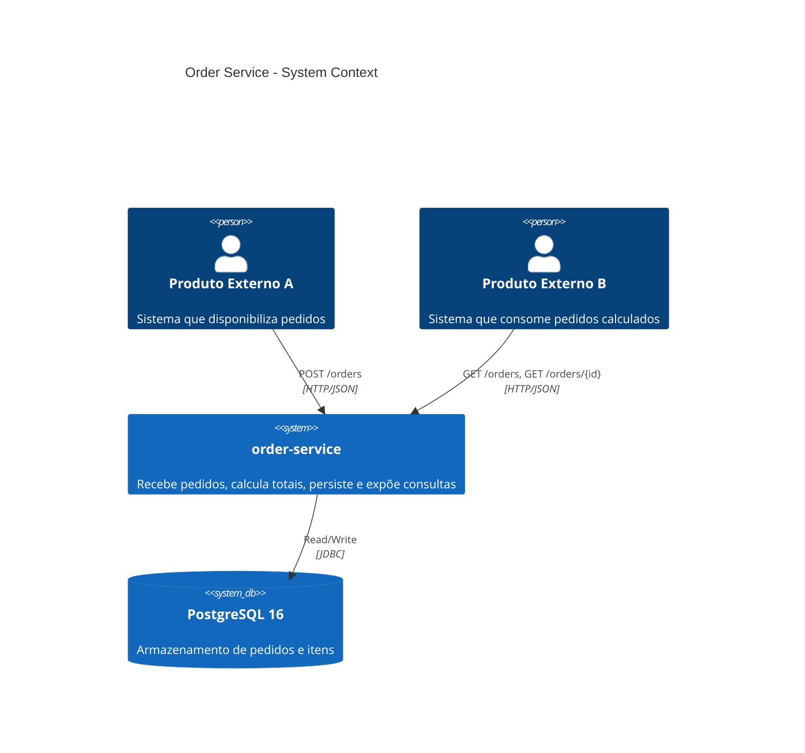
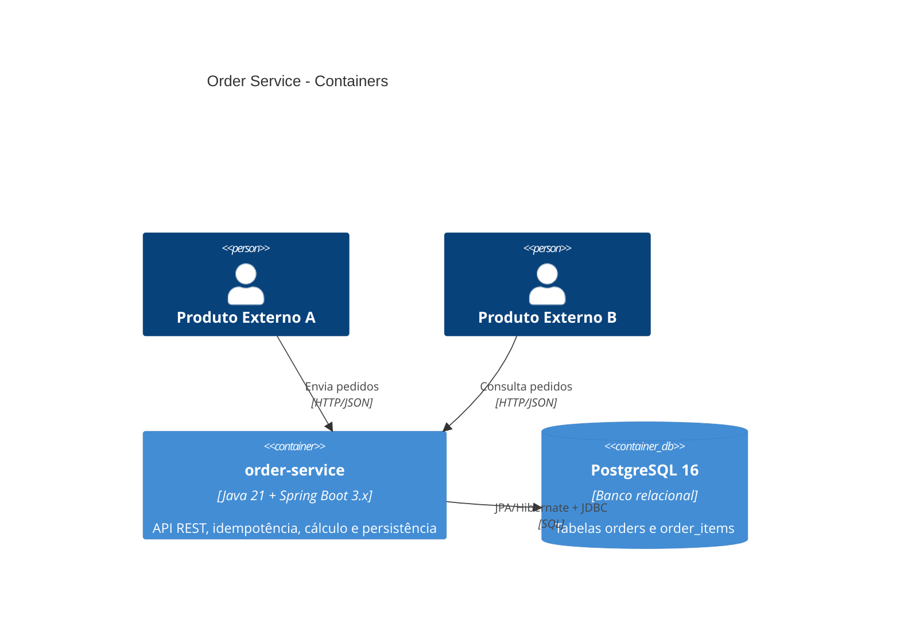
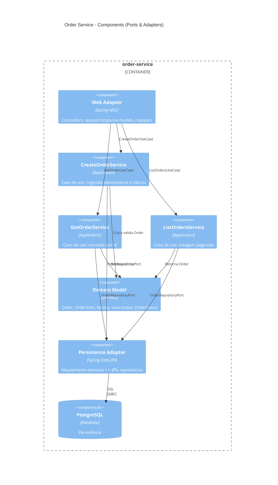

# Architecture

Este documento descreve a arquitetura do microserviço **order** usando o modelo **C4** (Context, Container, Component).

## Context (C4)

## Containers (C4)

## Components (C4)

## Notas relevantes

- **Clean Architecture**: domínio não depende de Spring/JPA.
- **Idempotência**: `externalOrderId` com UNIQUE no banco + tentativa de insert em transação e fallback para leitura.
- **Observabilidade**: `X-Correlation-Id` + MDC (logs) + Actuator.
